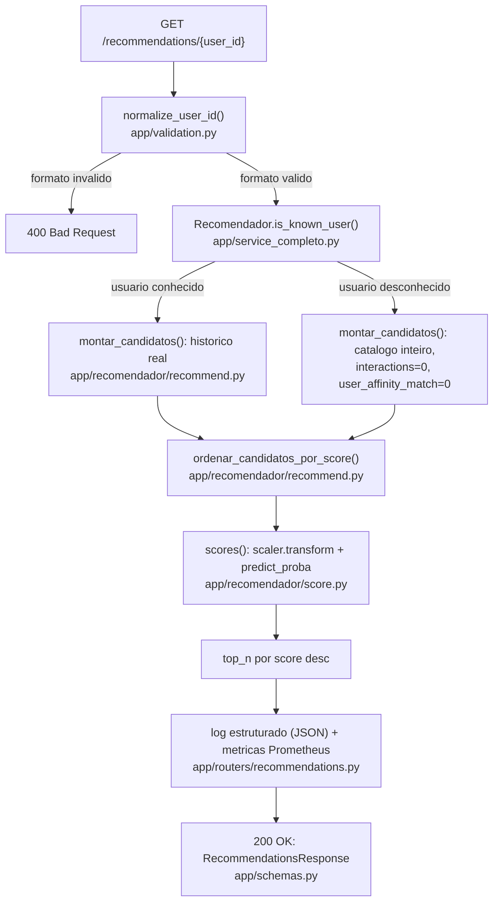

# AGENTS.md — mapa de navegação do CASE-ITAU-ENGML

Este arquivo existe para qualquer um (humano ou assistente de IA) descobrir rápido **onde mexer**
para uma mudança específica, sem precisar ler o projeto inteiro primeiro. Ele não repete decisões
já documentadas — aponta para elas.

- **Por quê as coisas são como são** → [`docs/adr/`](docs/adr/) (Architecture Decision Records)
- **Como rodar/testar, decisões de arquitetura e trade-offs** → [`SOLUTION.md`](SOLUTION.md)
- **Onde exatamente mexer para cada tipo de mudança** → [`docs/ROUTING.md`](docs/ROUTING.md)

## Identidade do projeto, em 3 linhas

Microsserviço FastAPI que serve recomendações de produto a partir de um modelo de propensão de
compra **já treinado** (não é re-treinado por este projeto). O Model da aplicação é a classe
`Recomendador` (`app/service_completo.py`), que delega a lógica de negócio para funções puras em
`app/recomendador/`.

## Ciclo de vida de uma requisição

## Tabela de roteamento

Ver [`docs/ROUTING.md`](docs/ROUTING.md) — tabela completa "quero mudar X → vá em Y → cuidado com Z".

## Onde NÃO mexer sem entender o trade-off primeiro

Cada item aqui tem um ADR correspondente — leia antes de alterar:

| Não mexer sem ler | ADR |
|---|---|
| Job de ingestão rodando **dentro** do build do Docker (não no startup do container) | [`docs/adr/0001-features-batch-precomputadas.md`](docs/adr/0001-features-batch-precomputadas.md) |
| Cold start usando o **mesmo** caminho de scoring que usuário conhecido | [`docs/adr/0002-cold-start-caminho-unico.md`](docs/adr/0002-cold-start-caminho-unico.md) |
| Validação de `user_id` **antes** de qualquer lógica de negócio, separada de cold start | [`docs/adr/0003-validacao-separada-de-cold-start.md`](docs/adr/0003-validacao-separada-de-cold-start.md) |
| `docker-compose.yml` com 3 containers separados (API, Prometheus, Grafana) | [`docs/adr/0005-containers-separados.md`](docs/adr/0005-containers-separados.md) |
| `Recomendador` (`app/service_completo.py`) sendo o Model, não `app/model_service.py` (removido) | [`docs/adr/0008-recomendador-substitui-model-service.md`](docs/adr/0008-recomendador-substitui-model-service.md) |
| Ausência de autenticação/rate limiting na API | Gap conhecido, não implementado — ver seção abaixo |

## Roteiro de raciocínio para qualquer mudança

1. Leia a linha correspondente em [`docs/ROUTING.md`](docs/ROUTING.md).
2. Se houver um ADR relacionado, leia o `Contexto`/`Decisão` antes de alterar — pode existir um
   motivo não óbvio pela escolha atual.
3. Rode a suíte de testes **antes** de alterar (`python -m pytest -v`, na raiz) — baseline de que
   tudo passa.
4. Faça a mudança.
5. Rode a suíte de novo. Se `tests/test_model_quality_gate.py` falhar, o modelo/score se desviou do
   baseline — investigue antes de seguir (ver [`scripts/compute_score_baseline.py`](scripts/compute_score_baseline.py)).
6. Se o **contrato** mudou (formato de resposta, novo endpoint, novo parâmetro), atualize
   `app/schemas.py`, os testes de `tests/test_api.py`, e este `AGENTS.md` se a tabela de roteamento
   também mudou.
7. Se a mudança foi uma decisão de arquitetura nova (não só uma correção), considere escrever um ADR
   novo em `docs/adr/` (use o template no topo de qualquer ADR existente).

## Gaps conhecidos, não implementados

Listados aqui para não serem redescobertos por engano como "bugs" — são omissões conscientes,
documentadas em [`SOLUTION.md`](SOLUTION.md):

- Autenticação e rate limiting na API.
- Ingestão incremental (hoje é batch, requer rebuild da imagem para atualizar dados).
- Detecção de data drift (distribuição de score é monitorada; comparação estatística formal
  contra a distribuição de treino, não).
- Alertas configurados sobre os thresholds do Grafana (painéis existem, alerta automático não).
- Tracing distribuído (só faz sentido quando este serviço chamar outros serviços).
- Estratégia de deploy zero-downtime (blue/green, canário, shadow) — hoje `docker compose up
  --build` recria o container diretamente.
- CD automatizado (CI existe; não há alvo de deploy real provisionado).

## Índice dos arquivos-chave

| Arquivo | Papel |
|---|---|
| `app/main.py` | Raiz de composição: monta a app FastAPI, lifespan, handler de erro global |
| `app/routers/recommendations.py` | Controller: rotas HTTP (`/health`, `/recommendations/{user_id}`) |
| `app/service_completo.py` | Model: classe `Recomendador` — carrega modelo/dados, expõe `recommend()` e `is_known_user()` |
| `app/recomendador/user_check.py` | Função pura: usuário é conhecido? |
| `app/recomendador/recommend.py` | Funções puras: monta candidatos (cold start ou histórico), ordena por score |
| `app/recomendador/score.py` | Função pura: roda `scaler` + `model.predict_proba` |
| `app/validation.py` | Normaliza/valida formato do `user_id`, antes de qualquer lógica de negócio |
| `app/schemas.py` | View: contratos de resposta (Pydantic) |
| `app/metrics.py` | Métricas Prometheus customizadas (`recommendation_score`, `features_data_age_seconds`, etc.) |
| `app/dependencies.py` | Injeção de dependência do FastAPI (`get_service`) |
| `ingestion/features.py` | Lógica pura de feature engineering, testável sem I/O |
| `ingestion/build_features.py` | Job offline: `events.csv`+`products.csv` → parquet de features |
| `scripts/compute_score_baseline.py` | Recalcula o baseline de score usado pelo gate de qualidade |
| `tests/` | Suíte única (59 funções, 67 casos) — comportamento, dados, e gate de qualidade do modelo |
| `docker-compose.yml` | Orquestra API + Prometheus + Grafana como containers separados |
